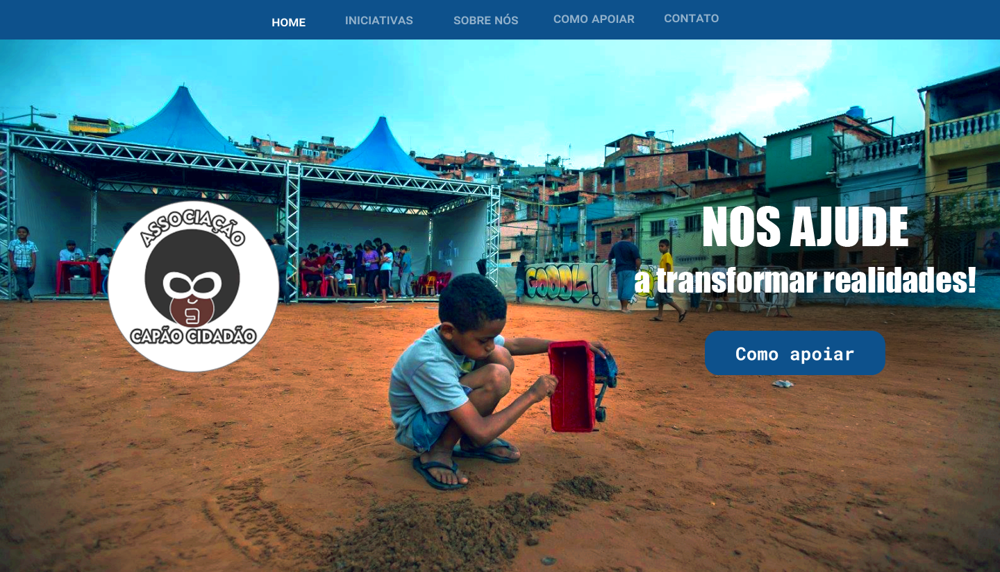

<h1 align="center">
  Associação Capão Redondo
</h1>

 Projeto realizado para a para ajudar a ONG na divulgação do projeto e centralização das informações

## 🎨 Layout

<h1 align="center">
  
</h1>

---

### 🛠 Tecnologias

As seguintes ferramentas foram usadas na construção do projeto:

- HTML
- CSS
- [Bootstrap 5](https://getbootstrap.com/)

---

### Autor

<a href="https://github.com/viniblack">
 
  
 <b>Vini Black</b></a> <a href="https://github.com/viniblack" title="GitHub">👨‍💻 🚀 🖤</a>

 
 

---

## 📝 Licença

Este projeto esta sobe a licença [MIT](./LICENSE).

Feito por Vini Black 👋🏽 [Entre em contato!](https://www.linkedin.com/in/viniblack/)

---
